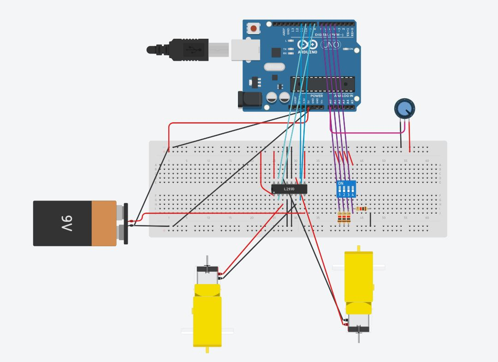

# R3-SoftwareTraining-AvinandanKundu
# Author Info:   Name - Avinandan Kundu (He/Him)   Email - a1kundu@ryerson.ca   LinkedIn - https://www.linkedin.com/in/avinandan-kundu/

# Task Info:
Testing mini rover's drive and motor controls.  
In this module, I wired and programmed two motors to an Arduino with the help of a L293D motor controller.  
Additionally, a potentiometer was implemented to manipulate the motor's speed with Pulse Width Modulation (PWM). 
Finally, a dip switch was used to switch between the various control/direction modes. 
The online 3D digital modelling program, TinkerCad, was used to complete the task successfully.

# Links:
TinkerCad Project Link: https://www.tinkercad.com/things/4DxAUCwuMCk  
Github Code Link: https://github.com/Avinandan-Kundu/R3-SoftwareTraining-AvinandanKundu

# Screenshot:

Figure: Color coded wiring diagram for the setup
